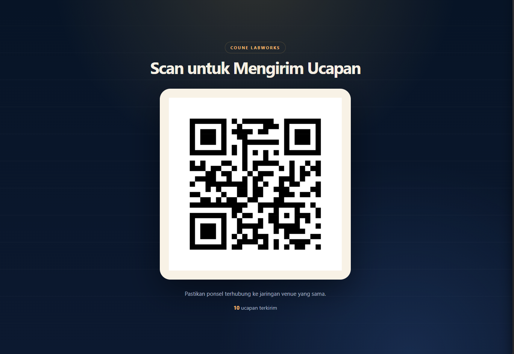
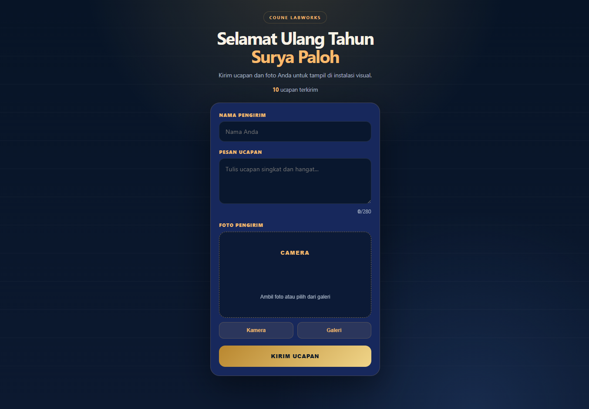

# Coune Labworks Birthday Interactive TouchDesigner Installation

Local-first birthday greeting system for the Surya Paloh event.

Visitors scan a QR code, submit name/message/photo from mobile, and the local server stores each submission for TouchDesigner. The server composes a 16:9 display card for each entry, pushes each saved record to TouchDesigner over OSC, and TouchDesigner still polls the local database as a fallback. TouchDesigner fills a fixed 20-slot visual pool and renders a controlled 1920x1080 preview canvas.

## Architecture

```text
Visitor phone
  -> QR code on tablet
  -> Local web form
  -> Flask/Waitress server on TouchDesigner machine
  -> data/submissions.json + data/images/ + data/cards/
  -> OSC push /birthday/submission to TouchDesigner
  -> HTTP polling fallback if OSC fails
  -> TouchDesigner spawner framework
  -> spawner_pool/submission_01..20
  -> preview_select_XX -> preview_transform_XX
  -> all_cards_comp -> preview_level -> final_out
```

## File Organization

```text
server/
  app.py              Flask app and API routes
  config.py           event/server config
  storage.py          local JSON/image persistence
  validation.py       input validation and sanitization
  requirements.txt

web/
  index.html          mobile visitor form
  thank-you.html      confirmation page
  qr.html             tablet QR display
  admin.html          operator preview/reset page
  css/style.css
  js/form.js
  js/admin.js

touchdesigner/
  td_build_network.py       installer/repair tool for TD operators
  td_spawner_framework.py   polling, pool, FIFO, motion, table output
  td_bridge.py              minimal fallback/reference
  README.md                 TD network setup notes

data/
  submissions.json
  images/
  logs/

docs/
  DEPLOYMENT.md
  img/                optional screenshots for docs
```

## Data Schema

Each saved record looks like:

```json
{
  "id": "8F3A2C",
  "timestamp": "2026-06-25T15:30:12+07:00",
  "name": "Budi",
  "message": "Selamat ulang tahun, semoga panjang umur dan sukses selalu.",
  "image": "20260625_153012_8F3A2C.jpg",
  "card": "20260625_153012_8F3A2C_card.jpg",
  "device": "Mozilla/5.0 ..."
}
```

Raw uploads are stored in `data/images/` and referenced by `image`. The composed 16:9 TouchDesigner display cards are stored in `data/cards/` and referenced by `card`.

TouchDesigner copies images into a short local cache path before loading:

```text
C:/Users/PC/Documents/IMAGES_CACHING/
```

## Run Locally

For event deployment on Windows, double-click:

```bat
run_event_server.bat
```

This uses Waitress, which is more suitable for a long-running local event server.

For quick development only, you can also double-click:

```bat
run_server.bat
```

Or run manually:

```powershell
py -m venv .venv
.\.venv\Scripts\activate
python -m pip install -r server\requirements.txt
waitress-serve --host=0.0.0.0 --port=8080 "server.app:app"
```

Open:

- Visitor form: `http://localhost:8080/`
- Tablet QR page: `http://localhost:8080/qr`
- Admin page: `http://localhost:8080/admin`
- TouchDesigner API: `http://localhost:8080/api/submissions/latest`

For visitor phones, use the event machine's local IP instead of `localhost`, for example:

```text
http://192.168.1.20:8080/qr
```

## Web Preview

Visitor form:

```text
http://localhost:8080/
```

Tablet QR display:

```text
http://localhost:8080/qr
```

Admin/operator panel:

```text
http://localhost:8080/admin
```

Optional documentation screenshots can be stored in `docs/img/`, for example:




## Backend Flow

1. Receive multipart form submission.
2. Validate name, message, and photo.
3. Reject empty fields, invalid image formats, oversize files, and unsafe paths.
4. Generate a short unique ID.
5. Save raw image as `YYYYMMDD_HHMMSS_ID.ext`.
6. Compose the final 16:9 entry card as `YYYYMMDD_HHMMSS_ID_card.jpg`.
7. Append metadata to `data/submissions.json` atomically.
8. Push the saved record to TouchDesigner over OSC.
9. Expose latest records for TouchDesigner polling fallback.

## Frontend Flow

1. Visitor scans QR code.
2. Mobile form opens immediately.
3. Visitor fills name and birthday message.
4. Visitor captures photo using camera or chooses from gallery.
5. Form submits to local server.
6. Visitor sees a thank-you screen.

## TouchDesigner Strategy

The active runtime script is:

```text
touchdesigner/td_spawner_framework.py
```

The installer/helper script is:

```text
touchdesigner/td_build_network.py
```

The preferred live path is OSC:

```text
UDP 127.0.0.1:9001
OSC address /birthday/submission
Payload: JSON submission record string
```

The spawner also polls as a fallback/reconciliation path:

```text
GET /api/submissions/latest?since=<last_id>
```

It maintains:

- `database_table`: synced backend records with raw image and composed card paths
- `queue_table`: submissions waiting for display
- `active_table`: visible entries and their position/scale values
- `stats_table`: health/count/error state
- `spawner_pool`: fixed pool of `submission_01..20`
- `osc_submission_in`: OSC receiver on port `9001`
- `osc_submission_callbacks`: forwards OSC JSON into the same spawner queue

Rendering path:

```text
/project1/submission_controller/spawner_pool/submission_XX/out1
  -> /project1/preview_select_XX
  -> /project1/preview_transform_XX
  -> /project1/all_cards_comp
  -> /project1/preview_level
  -> /project1/final_out
```

Display behavior:

- Maximum 20 active entries.
- Empty pool slots are blanked: no image, no name, no message, scale 0.
- `hardRefresh()` fully re-syncs after backend reset/delete/re-entry.
- FIFO replacement is used when active entries exceed the pool limit.
- Manual refresh seeds display from backend with latest entries and random older entries.
- TouchDesigner loads the composed `card` image for display while keeping raw `image`, name, and message in tables/custom parameters.
- Motion values are written to stable custom parameters: `Posx`, `Posy`, `Cardsx`, `Cardsy`.
- OSC and polling share the same database/queue flow, so duplicate IDs are ignored.

## Event Deployment Notes

- Use a dedicated local router. Internet is not required.
- Connect the TouchDesigner/server PC, tablet, and visitor Wi-Fi to the same network.
- Allow Windows Firewall access for Python on port `8080`.
- Allow local UDP port `9001` for TouchDesigner OSC receive if Windows Firewall prompts.
- Keep the tablet open on `/qr`.
- Keep admin page open on `/admin` for the operator.
- Test camera upload on iPhone and Android before doors open.
- Keep `MAX_ACTIVE_ITEMS` at 20 unless the final machine/GPU can safely handle more.
- Back up `data/submissions.json` and `data/images/` after the event.

## Operator Controls

Admin reset endpoint requires token:

```text
coune-labworks-2026
```

The admin panel supports:

- Preview all submissions.
- Select one or more entries.
- Delete selected entries and their photos.
- Reset all entries and photos.

For production, set a different token before launching:

```powershell
$env:BIRTHDAY_ADMIN_TOKEN="hbd-2026-by-clw"
python server\app.py
```

## Visual Direction

Keep the screen premium and readable:

- 1920x1080 black canvas.
- Up to 20 small composed entry cards.
- Photo and text are composed in the backend into `data/cards/` before TouchDesigner displays them.
- Name and message should remain visually tied to the correct photo.
- Text should be white/high contrast against the black canvas.
- Use restrained flowing/upward motion and random drift.
- No uncontrolled object creation; use the fixed `spawner_pool`.
