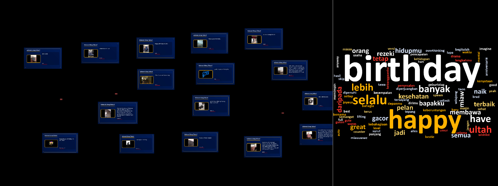

# TouchDesigner Setup Guide

This folder contains the TouchDesigner-side framework for receiving live web submissions over OSC, falling back to the local web submission database, and rendering composed visitor entry cards on a controlled 1920x1080 canvas.

Use these files:

```text
touchdesigner/td_build_network.py        installer, repair tools, diagnostics
touchdesigner/td_spawner_framework.py    OSC receiver target, poll fallback, pool manager, motion logic
touchdesigner/td_bridge.py               old minimal fallback/reference
```

## Current Architecture

```text
/project1
├─ build_net                                  Text DAT containing td_build_network.py
├─ submission_controller                       Base COMP
│  ├─ spawner                                  Text DAT containing td_spawner_framework.py
│  ├─ execute_spawner                          Execute DAT, frame-start callback
│  ├─ osc_submission_in                        OSC In DAT, UDP port 9001
│  ├─ osc_submission_callbacks                 Text DAT, forwards OSC JSON to spawner
│  ├─ database_table                           Table DAT
│  ├─ queue_table                              Table DAT
│  ├─ active_table                             Table DAT
│  ├─ stats_table                              Table DAT
│  └─ spawner_pool                             Base COMP
│     ├─ submission_01                         pooled entry slot
│     ├─ submission_02
│     ├─ ...
│     └─ submission_20
│
├─ submission_template                         Base COMP copied into pool slots
│  ├─ photo                                    Image/Movie File In TOP
│  ├─ fit_photo
│  ├─ level_photo
│  ├─ photo_layout                             Transform TOP, currently neutral
│  ├─ name_text
│  ├─ level_name
│  ├─ name_layout                              Transform TOP, currently neutral
│  ├─ message_text
│  ├─ level_message
│  ├─ message_layout                           Transform TOP, currently neutral
│  ├─ card_bg
│  ├─ composite_card
│  ├─ final_level                              optional/manual grading
│  ├─ opacity
│  └─ out1                                    stable production output
│
├─ preview_select_01..20                       Select TOPs for pool outputs
├─ preview_transform_01..20                    per-entry canvas transform
├─ all_cards_comp                              Composite TOP
├─ preview_level                               Level TOP
├─ final_out                                   1920x1080 Null TOP
├─ window1                                     Window COMP
├─ auto_wire_preview                           Text DAT helper
├─ execute_auto_wire_preview                   Execute DAT helper
└─ birthday_controls                           Text DAT helper commands
```

## Install / Update

1. Create `/project1/build_net` as a Text DAT.
2. Paste the full contents of `touchdesigner/td_build_network.py`.
3. Run:

```python
op("/project1/build_net").module.installBirthdayTouchDesigner()
```

This installs the spawner runtime into:

```text
/project1/submission_controller/spawner
```

It also creates or repairs:

- `submission_controller`
- `submission_template`
- `spawner_pool/submission_01..20`
- `preview_select_01..20`
- `preview_transform_01..20`
- `all_cards_comp -> preview_level -> final_out`
- `osc_submission_in` and `osc_submission_callbacks`
- helper DATs and diagnostics

## Normal Operation

Keep the backend server and TouchDesigner network running. Each new web entry is saved to `data/submissions.json`, pushed immediately to TouchDesigner over OSC, then inserted into the same queue/display flow used by the polling fallback.

The backend stores both:

```text
data/images/   raw uploaded photos
data/cards/    composed 16:9 display cards
```

TouchDesigner loads the `card` file into `photo`; raw `image`, sender name, and message remain available in `database_table`, `active_table`, and custom parameters.

OSC live path:

```text
UDP 127.0.0.1:9001
Address: /birthday/submission
Payload: JSON submission record string
```

Fallback path, still active every frame cycle:

```text
GET /api/submissions/latest?since=<last_id>
```

Use `hardRefresh()` only when you need to rebuild from backend state:

```python
op("/project1/submission_controller/spawner").module.hardRefresh()
op("/project1/auto_wire_preview").module.wirePreviewCards()
```

Use `hardRefresh()` after:

- admin reset
- deleting entries
- restarting the backend

Use `manualRefresh()` only for lighter refreshes:

```python
op("/project1/submission_controller/spawner").module.manualRefresh()
```

## Pool Behavior

The system uses a fixed pool of 20 reusable entry COMPs:

```text
spawner_pool/submission_01..20
```

Each active entry writes:

```text
photo.par.file        cached image path
name_text.par.text    sender name
message_text.par.text sender message
Posx                  normalized source x
Posy                  normalized source y
Cardsx                scale x
Cardsy                scale y
Opacity               display opacity
Age                   seconds since spawn
```

Unused pool slots are blanked:

- empty image path
- empty name/message
- opacity 0
- scale 0
- render/display disabled

## Preview Rendering

Current preview chain:

```text
submission_XX/out1
→ preview_select_XX
→ preview_transform_XX
→ all_cards_comp
→ preview_level
→ final_out
```

`final_out` should be:

```text
1920 x 1080
```

Check it with:

```python
op("/project1/build_net").module.diagnosePreviewResolution()
```

Expected:

```text
/project1/preview_bg: 1920x1080
/project1/preview_transform_01: 1920x1080
/project1/all_cards_comp: 1920x1080
/project1/preview_level: 1920x1080
/project1/final_out: 1920x1080
```

## Position And Scale

The spawner writes pixel-space motion values into custom parameters:

```text
Posx
Posy
Cardsx
Cardsy
```

`preview_transform_XX` maps `Posx` and `Posy` into a safe normalized range:

```text
-0.3 .. 0.3
```

Scale stays controlled by:

```text
Cardsx
Cardsy
```

Default scale range is configured in `td_spawner_framework.py`:

```python
MIN_CARD_SCALE = 0.18
MAX_CARD_SCALE = 0.26
```

## Motion Logic

Runtime behavior:

- Max 20 active entries.
- New entries are read from the backend.
- If active entries exceed 20, FIFO replacement is used.
- Manual refresh favors newest entries with some random older entries.
- Entries drift upward with slow random horizontal movement.
- Empty slots remain blank.

Key constants in `td_spawner_framework.py`:

```python
MAX_ACTIVE_ITEMS = 20
CANVAS_WIDTH = 1920
CANVAS_HEIGHT = 1080
FLOW_SPEED_PIXELS_PER_SECOND = 18.0
SHUFFLE_INTERVAL_SECONDS = 60.0
```

## Diagnostics

Backend and TD status:

```python
op("/project1/build_net").module.diagnoseBirthdayTouchDesigner()
```

Visual chain status:

```python
op("/project1/build_net").module.diagnoseBirthdayVisuals()
```

Preview resolution:

```python
op("/project1/build_net").module.diagnosePreviewResolution()
```

Show a single card directly, bypassing preview:

```python
op("/project1/build_net").module.showFirstCardDirect()
```

Restore normal preview:

```python
op("/project1/build_net").module.restorePreviewOutput()
```

Wire card outputs directly without transforms for debugging:

```python
op("/project1/build_net").module.wireCardsNoTransform()
```

## Common Repair Commands

Full safe reset/rebuild:

```python
op("/project1/build_net").module.installBirthdayTouchDesigner()
op("/project1/build_net").module.rebuildBirthdayPool()
op("/project1/build_net").module.repairBirthdayPreview()
op("/project1/submission_controller/spawner").module.hardRefresh()
op("/project1/auto_wire_preview").module.wirePreviewCards()
```

Refresh after new web submissions:

```python
op("/project1/submission_controller/spawner").module.manualRefresh()
```

Check backend count from TouchDesigner:

```python
op("/project1/build_net").module.diagnoseBirthdayTouchDesigner()
```

## Output Preview Screenshot

Screenshots for documentation are stored in:

```text
docs/img/
```

Current screenshots:

```markdown



```

- `qr.png`: tablet QR screen used by visitors to open the submission form.
- `dashboard.png`: visitor submission form for sender name, message, and photo upload.
- `output.png`: TouchDesigner final output capture with composed cards on the black 1920x1080 canvas.
- `output-preview.png`: TouchDesigner preview showing animated composed cards and the generated favorite-word cloud.

## Notes

- `td_build_network.py` is safe to rerun.
- `rebuildBirthdayPool()` deletes and recreates generated pool COMPs, so only use it when template/pool structure changes.
- For normal event operation, let OSC/polling run; do not refresh per entry.
- If a slot is not in use, it should display nothing.
- If the web/admin panel shows new entries but TD does not, check that `osc_submission_in` is active on UDP `9001`, then run `diagnoseBirthdayTouchDesigner()` and compare `backend count` with `database_count`.
